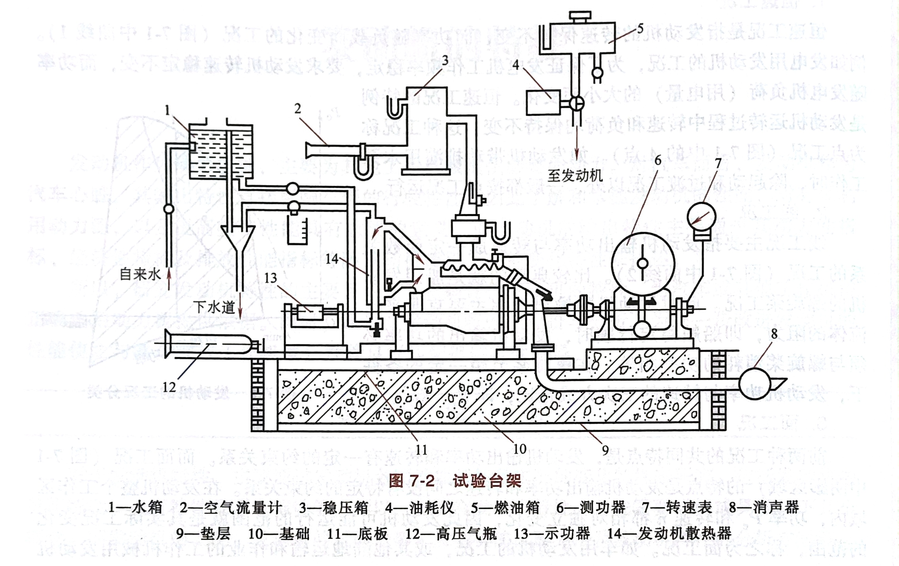
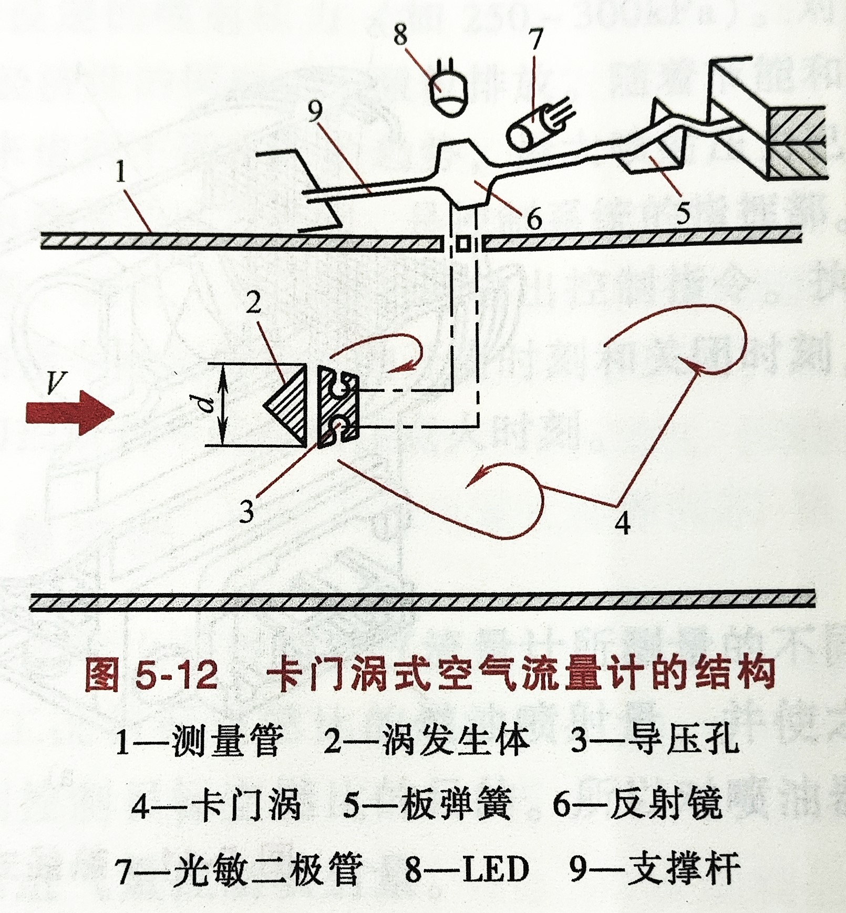

# 填空题

1. 汽油机、柴油机燃烧阶段

   > 1. 着火延迟阶段（滞燃期）
   > 2. 明显燃烧期（急燃期、火焰传播阶段）
   > 3. 后燃期

2. 不规则燃烧包括哪些

   > 1. 爆燃
   > 2. 表面点火
   >    1. 早燃
   >    2. 后燃

3. 柴油的自燃的评价参数

   > 1. 十六烷值
   > 2. 馏程
   > 3. 粘度
   > 4. 凝点
   > 5. 热值

4. 汽油机排放物有哪些

   > 1. $CO_2$
   > 2. $H_2O$
   > 3. $HC$
   > 4. $CO$
   > 5. $NO_x$

5. 影响汽油机排放的因素有哪些

   > 1. 过量空气系数$\phi_a$
   > 2. 点火提前角
   > 3. 转速
   > 4. 负荷

6. 影响氮氧化合物排放的因素有哪些

   > 1. 燃烧温度
   > 2. 氧含量
   > 3. 整个燃烧反应时间

   > 1. 混合气中$O_2$（或$N_2$）的含量
   > 2. 燃烧温度
   > 3. 高温燃烧带内滞留的时间

7. 第七章公式

# 名词解释题

1. 爆燃

   > 爆燃是指火花塞点火后，离火花塞最远的末端气体受到火焰前锋面的热辐射和压缩作用，使其压力、温度升高而导致在火焰前锋面到达之前自行燃烧的现象。产生爆燃后的特征是缸内燃烧速度极快，可达每秒数百米，造成很大的压力梯度和温度梯度，从而形成缸内压力冲击波。

1. 气门重叠

   > 根据四冲程内燃机的工作原理，在进气上止点，由于进气门提前开启、排气门迟后关闭而造成进排气门同时开启的现象，这种现象称为气门叠开现象。

2. 充气效率

   > 内燃机的充气效率定义为，每循环实际进入气缸的新鲜充量$m_1$与进气状态下充满气缸工作容积的理论充量$m_2$之比，即
   > $$\phi_c = \frac{m_1}{m_{sh}} = \frac{V_1}{V_s} \label{充气效率}$$
   > 式$\eqref{充气效率}$中，$m_1$、$V_1$分别为实际进入气缸的新鲜充量的质量和体积；$m_{sh}$、$V_s$分别为在进气状态下充满气缸工作容积的新鲜充量的质量和气缸工作容积。

3. 发动机特性

   > 发动机特性是指发动机在不同工况下的性能参数，如转速、转矩、功率、油耗等。不同类型的发动机有不同的特性曲线，反映了发动机的动力、经济性和可靠性。一般来说，发动机的特性可以分为负荷特性、速度特性和外特性。

4. 示功图

   > 示功图是指反映发动机或压缩机在一个工作循环中气缸内容积和压力的变化关系的图形。示功图中曲线所围成的面积表示发动机或压缩机对气体所做的功。示功图可以用来分析发动机或压缩机的性能和工作状况。

5. 气门叠开

6. 表面点火

   > 凡是不依靠火花塞点火，而是由燃烧室内部炽热表面点燃混合气的现象，称为表面点火。当发动机长期在高负荷下工作时，燃烧室内的排气门、火花塞裙部，以及积炭等沉积物往往可以成为炽热表面。表面点火的主要特点是，炽热表面积比点火表面积大，所以燃烧速度快，而且混合气着火时刻不可控制。

7. 不规则燃烧

   > 不正常燃烧是指发动机在运转时，由于可燃混合气配比超差（过浓或过稀）、发动机机械原因、点火系统等故障引起的点火能量小、燃烧质量差、不能燃烧或不充分燃烧的一种异常现象。不正常燃烧会导致发动机性能下降、油耗增加、排放恶化、机件损坏等危害。

8. 动态效应

   > 动态效应就是指利用内燃机在间歇地进行进排气过程中产生的进排气管内的压力波，来提高充气效率的方法。进气管的动态效应主要分为惯性效应和波动效应两种。

# 简答题

1. 发动机气门间隙不能过大也不能过小的原因

   > 发动机气门间隙是指发动机在冷态下，气门完全关闭时，气门杆末端与传动件（或直动式凸轮与挺柱）之间的间隙。发动机气门间隙的作用是为了保证发动机在热态下气门能够正常关闭，防止发生漏气现象。
   >
   > 发动机气门间隙不能过大也不能过小，否则会对发动机的性能和寿命产生不利影响。
   >
   > - 如果气门间隙过大，会导致气门传动零件之间及气门和气门座之间产生撞击响声，并加速磨损， 并使气门开启的持续时间减少，导致发动机进气量不足及排气不彻底，影响发动机动力性；
   > - 如果气门间隙过小，会导致发动机在热态下气门关闭不严而发生漏气，导致发动机功率下降，甚至烧坏气门。

2. 汽油发动机碳氢产生的机理

   > 1. 缸内壁面淬冷效应
   >
   >    当燃烧过程中火焰传播至气缸壁面时，温度较低的壁面对火焰迅速冷却，此时如果火焰前锋面的温度降低到混合气自燃点以下时，链式反应中断，火焰熄灭，从而在燃烧室壁面留下一层$0.1-0.3mm$厚的未燃或未完全燃烧的混合气，产生大量的$HC$。
   >
   > 2. 缝隙效应
   >
   >    汽油机燃烧室内的缝隙，主要有活塞头部和缸壁之间，气缸盖、气缸垫和气缸体之间，进、排气门和气门座之间，以及火花塞螺纹处和火花塞中心电极周围等处。
   >
   >    缝隙面容比大，火焰无法传入其中继续燃烧，而且缝隙内的混合气受到两个以上壁面的冷却，故淬冷效应十分强烈而产生大量未燃$HC$。
   >
   > 3. 积炭和壁面油膜的吸附效应
   >
   >    气缸壁面上的润滑油膜、沉积在活塞顶部以及燃烧室壁面和进排气门上的多孔性积炭，会吸附未燃混合气及燃料蒸气，这些被吸附的气体在膨胀和排气过程中逐步脱附释放出来，随已燃气体排出气缸而造成排气中的$HC$含量增加。
   >
   > 4. 不完全燃烧
   >
   >    如发动机在怠速及高负荷工况下运行时，混合气处于$\phi_a<1$的浓混合气状态，且怠速时残余废气系数较大；而当加速或减速时，混合气会暂时地过浓或过稀，即使此时$\phi_a>1$，油气混合也不均匀。因此在这些条件下，都会造成不完全燃烧而使$HC$排放增加。
   >
   > 5. 失火
   >
   >    发动机工作过程中失火现象的发生，是造成大量$HC$（体积分数可达$5\%$）排放的主要原因。因此，对汽油机可靠点燃，防止失火是控制$HC$排放的重要环节。汽油机易发生失火的条件是，混合气形成过程中局部地方混合气过稀或过浓超过着火界限，或点火时刻不当及点火系统出现故障时等。

3. 废气再循环（EGR）的定义及作用

   > - 定义
   >
   >   废气再循环（EGR）是在内燃机换气过程中，将已排出气缸的废气的一部分再次引入进气管与新鲜气体一起进入气缸的过程。
   >
   > - 作用
   >
   >   EGR是用来调节混合气的组成成分，提高混合气的总热容，由此控倒燃烧速率，降低最高燃烧温度，达到在保持动力性和经济性基本不变的条件下，降低$NO_x$排放量的目的。

4. 汽油机加速工况对混合气浓度的要求

   > - 在急加速时，要求混合气量要突增，并保证浓度不下降，以满足发动机的动力需求。
   > - 在急加速时，必须采用专门的装置额外供油，加浓混合气，以防止混合气过稀导致发动机动力下降或熄火。
   > - 在急加速时，应供给较浓的混合气，一般为$α=0.85-0.95$。

5. 发动机进排气门早开晚关的原因（优点）

   > - 排气提前角
   >
   >   为了尽可能多地排气，同时减小排气行程中气门处的节流损失，以保证排气行程时气门已有足够的开度和流通截面积，一般设置排气提前角。即在膨胀做功过程中，在下止点前某一曲轴转角位置提前开启排气门。
   >
   > - 排气迟闭角
   >
   >   为了利用高速流经排气门的气流惯性尽可能多地排出废气，排气门在排气上止点之后某一时刻关闭。排气门关闭时刻相对上止点所对应的曲轴转角，称为排气迟闭角。
   >
   > - 进气提前角
   >
   >   为了保证进气门有足够大的流通截面积，尽可能使更多的新鲜充量顺利地进入气缸，进气门在上止点前提前某一时刻开启。进气门开启时刻相对上止点所对应的曲轴转角称为进气提前角。
   >
   > - 进气迟闭角
   >
   >   在进气下止点时气门处仍有高速气流流入气缸，为了充分利用气流的惯性而多进气，进气门在活塞下止点后关闭。进气门关闭时刻相对下止点所对应的曲轴转角称为进气迟闭角。

   > - 早开晚关可以延长进气和排气的时间，增加进气量和排气量，从而提高发动机的动力性能和经济性能。
   > - 早开晚关可以减小进气和排气的阻力，降低进气和排气过程消耗的功率，从而提高发动机的效率。
   > - 早开晚关可以利用气流的惯性，使进气更充分，排气更干净，从而提高发动机的燃烧效率和排放质量。

6. 发动机的机械损失包括哪些类型

   > 1. 摩擦损失
   >
   >    摩擦损失主要包括活塞与活塞环相对气缸的摩擦损失、曲轴轴颈和轴承的摩擦损失及配气机构的摩擦损失等。其中，活塞与活塞环相对气缸的滑动面积大、相对速度高、润滑条件差，所以其摩擦损失在整个摩擦损失中占主要部分。曲轴的主轴承、连杆轴承及凸轮轴承等均采用压力润滑，所以摩擦损失相对较小，但随轴承直径的增大及转速的提高，这一部分摩擦损失也将增加。摩擦损失占整个机械损失的$62\%-75\%$。
   >
   > 2. 驱动附件损失
   >
   >    为了保证发动机正常工作，除曲柄连杆机构及配气机构以外，还需要冷却系统、润滑系统、燃料供给系统等。这些辅助系统是内燃机连续可靠工作所必不可少的系统，辅助系统的正常工作是发动机可靠运行的重要保证。所以发动机工作时，需要消耗一定的功率去驱动轴助系统中的各工作附件，如冷却风扇、水泵、机油泵、喷油泵、空气压缩机及发电机等。随发动机转速的升高和润滑油黏度的增加，发动机驱动附件所消耗的损失增加。这一部分的损失占整个机械损失的$10\%-20\%$。
   >
   > 3. 泵气损失
   >
   >    泵气损失是发动机换气过程中产生的能量损失。为了便于分析将这一部分损失也归入到机械损失之中。由于在进气过程中存在进气流动损失，随着活塞的下移，气缸内产生真空，由此吸入新鲜气体的同时产生进气损失。同理，在排气过程中活塞推出一定压力的废气时，因排气阻力的存在而产生排气损失。泵气损失占整个机械损失的$10\%-20\%$。

7. 发动机爆震产生的机理

   > 爆燃是指火花塞点火后，离火花塞最远的末端气体受到火焰前锋面的热辐射和压缩作用，使其压力、温度升高而导致在火焰前锋面到达之前自行燃烧的现象。产生爆燃后的特征是缸内燃烧速度极快，可达每秒数百米，造成很大的压力梯度和温度梯度，从而形成缸内压力冲击波。发生爆燃时一般发出高频的金属敲击（敲缸）声，这种声音是压力冲击波在气缸内传播时撞击气缸壁而产生的。

8. 发动机燃烧过程的主要参数及其意义（评价参数、压力升高率、曲轴转角）

9. 提高充气效率的措施有哪些

   > 

10. 发动机产生的热量的分配。有多少是做功的，有多少是被排气管带走的，有多少是冷却水带走的

    > 发动机的热平衡，是指发动机实际工作过程中所加入气缸内的燃料完全燃烧时所放出的热量的具体分配情况。
    >
    > $$q_T = q_E+q_S+q_R+q_B+q_L \label{热平衡}$$
    > $\eqref{热平衡}$式中：
    >
    > - $q_T$为发动机所消耗燃油的总热量
    > - $q_E$为转化为有效功部分的热量
    > - $q_S$为传给冷却介质的热量
    > - $q_R$为由排出废气带走的热量
    > - $q_B$为燃料不完全燃烧的热损失
    > - $q_L$为其他热损失。
    >
    > 热平衡中各项数值范围
    >
    > | 形式       | $q_E=\frac{q_E}{q_T}$ | $q_S=\frac{q_S}{q_T}$ | $q_R=\frac{q_R}{q_T}$ | $q_B=\frac{q_B}{q_T}$ | $q_L=\frac{q_L}{q_T}$ |
    > | ---------- | --------------------- | --------------------- | --------------------- | --------------------- | --------------------- |
    > | 汽油机     | $25-30$               | $12-27$               | $30-50$               | $0-45$                | $3-10$                |
    > | 柴油机     | $30-40$               | $15-35$               | $25-45$               | $0-5$                 | $2-5$                 |
    > | 增压柴油机 | $40-50$               | $10-25$               | $25-40$               | $0-5$                 | $2-5$                 |
    >
    > 由此可知，内燃机实际工作过程中仅有燃料总热量的$25\%-50\%$的热量转换为有效功，而其余的$50\%-75\%$热量以各种形式损失掉了。其中损失最大的部分就是废气所带走的热量，占总热量的$25\%-50\%$，其次是传给冷却水的传热损失，占总热量的$10\%-35\%$。

11. 汽油发动机燃烧室有哪些基本要求

    > 1. 结构
    >
    >    燃烧室结构要紧凑，其紧凑程度常用面容比$\frac{A}{V}$表示，即燃烧室表面积和燃烧室体积之比。由此表征燃烧室内火焰传播距离、散热面积及熄火面积等特征。若$\frac{A}{V}$值小，表明燃烧室散热面积小、火焰传播距离短、熄火面积也小，所以有助于提高热效率和动力性，而且抗爆燃能力强，同时可减小$HC$排放。
    >
    > 2. 充气性能
    >
    >    气缸的充气性能取决于燃烧室形状与进气门、进气道的布置。在燃烧室结构设计时，要考虑应有较大的进气流通面积，如适当增大进气门直径、采用多气门布置等，同时保证进气流线短，转弯少且转弯半径尽可能大，以减小气流的流动损失，提高充气效率。
    >
    > 3. 火花塞的布置
    >
    >    对形状已确定的燃烧室，或在设计燃烧室结构形状时，必须要考虑火花塞的安装位置。布置火花塞时要求尽可能缩短末端气体的火焰传播距离，同时有利于火焰传播速度的控制，而且要使在火花塞安装位置上的气流相对稳定、残余废气的影响小，以保证可靠稳定地点燃混合气，减小循环变动。若空间允许的话，可安装两个火花塞，则燃烧速度更快，抗爆燃能力更强，可以适当提高压缩比，改善热效率，而且循环变动也小。
    >
    > 4. 燃烧室形状与气流运动
    >
    >    燃烧室形状应满足混合气形成及燃烧方式的要求，在气缸内组织适当的气流，在满足速燃要求的同时，通过火焰前锋面积控制燃烧速度和放热速度，在保证发动机动力性和经济性的前提下，减轻发动机的振动噪声，改善排放特性。但是过强的气流会使热损失增加，还有可能吹熄火焰核而失火，造成$HC$排放增加。所以，通过燃烧室形状与进气系统的合理匹配，组织燃烧室内适当的气流，是控制燃烧过程、改善发动机性能的重要环节。同时用什么样的参数指标评价燃烧室内的气流状态，也是分析研究内燃机混合气形成和燃烧过程的重要手段。
    >

# 看图填空题

1. 发动机台架实验

   > 

2. 卡门涡式空气流量计

   > 

# 论述题

1. 质量流量式电控汽油喷射系统

   1. 有哪些修正系数

   2. 为什么要修正这些系数

   > 修正系数$F_c$
   > 
   > $$F_c=f(F_{ET},F_{AD},F_0,F_L,F_H) \label{修正系数}$$
   >
   > 修正这些参数的目的是为了让电控汽油喷射系统能够根据不同的工况和环境条件，调整喷油量，以保证发动机的动力性能和经济性能。如果不进行修正，喷油量可能会过多或过少，导致发动机的燃烧不完全，增加油耗和排放，甚至损坏发动机。因此，修正这些参数是非常必要的。
   >
   > 1. 温度修正系数$F_{ET}$
   >
   >    温度修正系数$F_{ET}$主要考虑因温度不同而影响燃料喷雾质量所造成的混合气形成过程的影响。特别是在低温起动时，由于燃料雾化蒸发不良，往往造成实际形成的混合气过稀，从而导致发动机熄火。当发动机温度过高时，汽油在输送管路中易蒸发，从而减小实际喷射量。特别是在高温再起动时很容易产生「气阻」现象，影响高温再起动性。这就是说，发动机在高、低温条件下，按基本喷射脉宽$T_p$，喷射的燃料量均使混合气过稀，所以必须进行加浓修正，否则会造成发动机怠速不稳、高温再起动时易熄火以及游车等现象。
   >
   >    根据发动机实际运行状态，温度修正主要按以下三个方面分别进行。
   >
   >    1. 启动后增量修正系数$F'_g$
   >
   >       当发动机在低温起动时，着火后的数十秒内要进行增量修正。在起动过程中发动机的温度越低，燃料蒸发条件越差。所以，需燃料增量修正量越多，修正时间更长。这是因为，刚起动时进气道、进气门和气缸内壁等表面温度比较低，所以喷油器喷射后在其表面上形成的油膜不易蒸发，引起气缸内混合气变稀，所以需要加浓。$F'_g$是主要考虑进气道、进气门及气缸壁等表面温度低而影响其油膜蒸发量的喷射量增量修正系数。
   >
   >    2. 怠速暖车增量修正系数$F_I$
   >
   >       $F_I$主要修正起动后进气门、气缸壁的表面温度及冷却水温刀随时间升高的过程中，进气管及气门处所形成的油膜蒸发作用不足而造成的气缸内混合气偏稀的部分。与$F'_g$相同，$F_I$的修正值也随$T_w$的降低而增加，并与$F'_g$同时进行修正。但是，$F'_g$是在起动后数十秒内修正过程结束，而$F_I$则一直修正到$T_w$达到规定的目标温度为止。
   >
   >    3. 高温修正系数$F_T$
   >
   >       高温修正工况是指汽车在大负荷高速行驶后停车$10-30min$，然后再起动的$2-3min$时间内。高温修正的原因是，汽车在高速行驶时，由于迎面风的冷却作用，一般燃油温度低于$50^\circ C$。一旦停车，发动机作为热源而向四周散发热量，此时发动机停机，无冷却风冷却，使得发动机室内的温度升高，燃油温度可高达$80-100^\circ C$。因此，喷油器内的燃料沸腾，产生「气泡」现象。此时，再起动发动机时，即使喷油器的实际喷射脉宽工一定，但因喷射时含气泡，所以实际喷射量明显减少，缸内混合气变稀，无法正常起动，所以需要修正。修正方法是检测$T_w$，并当$T_w \geq 100^\circ C$时进行加浓修正，也可以直接测量燃油温度进行加浓修正。
   >
   > 2. 加减速修正系数$F_{AD}$
   >
   >    如前所述，当发动机加速运行时，随着节气门开度的增大，进气量增多，进气压力也增加，使得作用在进气管内壁表面附着的油膜表面压力增加，油膜蒸发速度降低，从而造成气缸内混合气变稀。相反，在减速时，随着节气门开度的减小，进气量减少，进气压力也随之降低，使得作用在进气管内壁表面附着的油膜表面压力降低，油膜蒸发速度加快，造成气缸内混合气变浓。此外，油膜附着部分的表面温度越低，油膜蒸发速度越慢，所以也影响气缸内的实际空燃比。因此，当发动机加减速运行时，如果只靠基本喷射脉宽来控制喷射量，就会使空燃比偏离目标值，使发动机工作不稳定，车辆前后方向振动（游车），而且排气中的有害成分也会增加。因此，必须要进行相应的修正。在进行加减速修正时，首先要正确、快速地判断加减速工况。为此，常利用节气门开度信号的变化率来进行工况判断。如由ECU每隔一定时间（如$80ms$）读取节气门开度信号，当在该时间内节气门开度的变化率超过某一规定值时，就判定为加减速状态。
   >
   >    1. 加速修正系数$F_{AC}$
   >
   >       加速工况修正系数的确定，主要考虑发动机负荷的变化对油膜蒸发量的影响和冷却水温的交化对油膜蒸发量的影响，即
   >       $$
   >       F_{AC} = F_{DL_1}F_{THW_1}
   >       $$
   >       式中、$F_{DL_1}$为对应负荷变化量的修正系数，主要修正进气压力（负荷）升高时，油膜蒸发汽化速度降低所造成的汽化不足的部分，负荷可用每转进入气缸的空气量$q_m/n$或节气门度表示；$F_{THW_1}$为对应冷却水温的修正系数，主要修正油膜附着部分的表面温度降低时。
   >
   >    2. 减速修正系数$F_{DC}$
   >
   >       与加速修正系数$F_{AC}$相反，当发动机减速时，节气门开度减小，进气压力随进气量的减小而降低，因而油膜表面压力减小，加快了其表面的蒸发速度，造成减速时气缸内的混合气变浓，所以必须进行减量修正。减速时的修正系数也要考虑负荷和冷却水温两个因素的影响，即
   >
   > 3. 氧传感器反馈修正系数$F_0$
   >
   >    一般汽油机均采用三效催化转化器来同时净化$CO$、$HC$和$NO_x$排放。而三效催化转化器只有在理论空燃比下，才能同时有效地净化$CO$、$HC$和$NO_x$三项有害物的排放。因此，为了有效控制汽油机的排放，需要精确控制理论空燃比。而开环控制不能精确地控制理论空燃比，所以，在排气管中安装氧传感器，测量排气中氧的含量，由此检测实际燃烧过程的空燃比，并对基本喷射脉宽进行反馈修正，实现对理论空燃比的反馈控制（闭环控制）。
   >
   > 4. 学习控制修正系数$F_L$
   >
   >    学习修正的目的，就是修正由于某种原因（如发动机长期使用使一些零部件磨损等）使反馈控制的空燃比偏离目标值的部分。
   >
   > 5. 大负荷高转速的增量修正系数$F_H$
   >
   >    一般发动机在部分负荷下运行时，混合气的控制主要考虑在保证排放性能的前提下，尽可能提供经济混合气，以达到最低燃油消耗率的目的。

