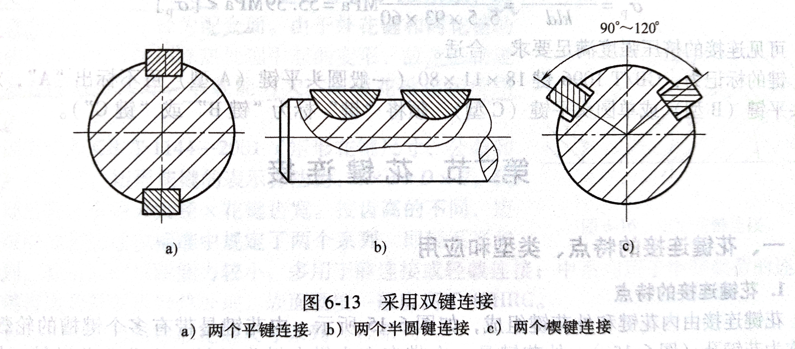

# 机械设计概论

## 机械零件的主要失效形式

1. 整体断裂
2. 过大的塑性变形
3. 过大的弹性变形
4. 零件的表面破坏
5. 破坏正常工作条件引起的失效
## 材料及选用

### 常用材料

### 材料选择原则

==选择材料主要应考虑三个方面问题：使用要求、工艺要求和经济要求。==

#### 使用要求

1. ==载荷、应力的大小和性质。==对于承受拉伸载荷为主的零件，宜用钢而不宜用铸铁；对于承受压缩载荷为主的零件，可考虑选择铸铁，以发挥其抗压强度比抗拉强度高得多和价廉的优点；对于变应力的零件，选择疲劳强度高的材料；对于承受冲击载荷的零件，选择韧性较好的材料；对于工作表面产生较大接触应力的零件，选择有利于表面硬化处理的材料，如调质钢、渗碳钢和渗氮钢等。
2. ==零件的工作情况（指工作环境、介质、温度、摩擦、磨损和重要程度等情况）。==对于做相对运动的零件，应选择减摩性、耐磨性好的材料，如适宜进行表面处理的淬火钢、渗碳钢等；对于高、低温下工作的零件，应选择耐热性、耐寒性好的材料；对于在腐蚀性介质中工作的零件，应选用耐腐蚀的材料；对于危及人身和设备安全的重要零件，常选用综合力学性能较好的材料，如高强度的合金钢等。
3. ==尺寸和质量的限制。==对于要求强度高而质量小的零件，应选择强度极限与密度之比高的材料，如铝合金、钛合金以及高强度合金钢等；对于要求刚度大而质量小的零件，则采用弹性模量与密度之比高的材料。对于合金钢和碳素钢来说，其弹性模量在$200^\circ C$以下时几乎相同，如果仅仅是为了提高零件刚度，用合金钢代替碳素钢是没有效果的。零件尺寸及质量的大小与材料的品种及毛坯制取方法有关。用铸造材料制造毛坯时，一般可以不受尺寸及质量大小的限制；而用锻造材料制造毛坯时，则须注意锻压机械及设备的生产能力。

#### 工艺要求

工艺要求主要与零件结构的复杂程度及材料的可加工性能有关。

==结构复杂的零件宜选用铸造毛坯，或用板材冲压出元件后再经焊接而成。结构简单的零件可用锻造法制取毛坯。==

对材料工艺性的了解，在判断可加工性能方面起着重要的作用。铸造材料的工艺性是指材料的液态流动性、收缩率、偏析程度及产生缩孔的倾向性等。锻造材料的工艺性是指材料的延展性、热脆性及冷态和热态下塑性变形的能力等。焊接材料的工艺性是指材料的焊接性及焊缝产生裂纹的倾向性等。材料的热处理工艺性是指材料的淬透性、淬火变形倾向性及热处理介质对它的渗透能力等。冷加工工艺性是指材料的硬度、易切削性、冷作硬化程度及切削后可能达到的表面粗糙度等。这些可参考机械工程材料手册。

#### 经济要求

经济要求主要是指材料的价格、加工费用及其利用率等。

1. ==材料本身的相对价格。==在机械的生产成本中，材料成本占很大的比重，低者占$30\%$（如中型机床)，高者占到$70\%-80\%$（如汽车、起重机）。当用价格低廉的材料能满足使用要求时，就不应该选择价格高的材料，这是机械设计的基本原则之一，这对于大批量制造的零件尤为重要。表2-3所示为常用金属材料的相对价格。
2. 材料的加工费用和利用率。例如，制造某些箱体类零件，虽然铸铁比钢板价廉，但在批量小时，选用钢板焊接反而较有利，因其可以省掉铸模的生产费用。采用少、无切屑毛坯（如精铸、冷辙、模锻、辗扩、冷拉毛坯等），既省料省工，又使金属流线连续、强度提高。例如，滚动轴承套圈的热、冷辗扩工艺就可以显著提高材料的强度和利用率。

3. ==采用组合结构。==例如，火车车轮是在一般材料的轮芯外部热套上一个硬度高而耐磨损的轮箍，这种选材的方法称为局部品质原则。例如，组合蜗轮是在钢铁材料的轮毂外部套上一个减摩性、耐磨性均较好的铸锡青铜齿圈，这样既可节省价格昂贵的青铜材料，又可以满足轮毂价廉和强度的要求，这种选材的方法称为任务分配原则。
4. ==节约稀有材料。==用我国富有元素（锰、硅、硼、钼、钒、钛等）合金钢代替稀有元素（铬、镍等）合金钢，如用锰硼系合金钢代替铬镍系合金钢制造轴，用铝青铜代替锡青铜制造轴瓦等。
5. ==材料的供应状况。==选材时还应考虑到当时当地材料的供应状况。为了简化供应和贮存的材料品种，对于小批量制造的零件，应尽可能地减少同一部机器上使用的材料品种和规格。

==可以通过更换材料来提高强度，但是不能通过更换材料来提高刚度。==

# 机械零件的强度

## 变应力的基本参数

|        名称        |      符号      | 定义及说明                                                   |
| :----------------: | :------------: | ------------------------------------------------------------ |
|      最大应力      | $\sigma_{max}$ | 循环变化中的应力最大值，按绝对值大小区分                     |
|      最小应力      | $\sigma_{min}$ | 循环变化中的应力最小值，按绝对值大小区分                     |
|      平均应力      |   $\sigma_m$   | $\sigma_m=\frac{\sigma_{max}+\sigma_{min}}{2}$，循环变化中不变的应力部分 |
|       应力幅       |   $\sigma_a$   | $\sigma_a=\frac{\sigma_{max}-\sigma_{min}}{2}$，循环变化中应力变化的幅度，均为正值 |
| 循环特性（应力比） |      $r$       | $r=\frac{\sigma_{min}}{\sigma_{max}}$，表示变应力的不对称性，其值为$-1\leq r\leq +1$ |

## 常见的几种典型变应力及基本参数特点

| 循环变化名称 | 循环特性  | 应力特点                                                     |
| :----------: | :-------: | :----------------------------------------------------------- |
|    静应力    |  $r=+1$   | $\sigma_{max}=\sigma_{min}=\sigma_m, \sigma_a=0$             |
|   对称循环   |  $r=-1$   | $\sigma_{max}=-\sigma_{min}=\sigma_a, \sigma_m=0$            |
|   脉动循环   |   $r=0$   | $\sigma_{min}=0, \sigma_m=\sigma_a=\frac{\sigma_{max}}{2}$   |
|  非对称循环  | $-1<r<+1$ | $\sigma_{max}=\sigma_m+\sigma_a, \sigma_{min}=\sigma_m-\sigma_a$ |

# 润滑

## 润滑形式

润滑的形式主要取决于传动的速度，传动的情况

### 常用的润滑方式

1. 人工定期加油
2. 滴油杯润滑
3. 油绳润滑
4. 油环、油链润滑

### 润滑方式选用原则

1. **低速、轻载、工作时间短或不连续运转等需油量较少的机械**：<u>一般采用人工定期加油</u>、<u>加脂，滴油或油绳</u>、<u>油垫润滑</u>。

2. **中速、中载、较重要的机械，要求连续供油并起一定冷却作用**：<u>常用油浴</u>、<u>油环</u>、<u>飞溅润滑</u>、<u>压力供油润滑</u>。

3. **高速、轻载机械零部件，如齿轮、轴承发热大**：<u>喷雾润滑</u>。

4. **高速、重载、供油量大的重要零部件**：<u>压力供油循环润滑</u>。
5. **当有大量润滑点和自动化程度高的重要机械设备或车间、工厂建立自动化润滑系统时**：<u>集中润滑装置</u>。

# 连接

# 螺纹连接和螺旋传动

螺纹连接是由螺纹连接件和被连接件构成的**可拆连接**，这种连接**结构简单，装拆方便，工作可靠**。由专业工厂大量生产的**标准螺纹连接件**，成本低廉，供应充足，应用广泛。对螺纹连接的基本要求是连接可靠不松动，受力合理并具有足够的强度。

## 螺纹的类型

## 螺纹连接的类型

### 螺栓连接

螺栓连接是利用螺栓穿过被连接件的通孔然后用螺母实现连接。被连接件的孔中无需切制螺纹，使用时不受被连接件材料的限制，==常用于被连接件不太厚便于制作通孔的场合==。按螺栓主要受力状况不同，可分为受拉螺栓连接和受剪螺栓连接两种，两种连接所用螺栓的结构形式和连接的结构细节也有所不同。

#### 普通螺栓连接

又称受拉螺栓连接，装配后螺栓杆与通孔之间有间隙（$d<d_0$），螺栓一般受拉伸载荷。这种连接结构简单，装拆方便，孔的精度要求较低，成本较低，==应用最广==。

#### 铰制孔用螺栓连接

又称受剪螺栓连接，其螺杆外径$d_s$。与孔径$d_0$具有同一公称尺寸（$d_s=d_0>d$），装配后螺栓杆与通孔之间有配合关系，常采用基孔制过度配合（$\frac{H7}{m6}, \frac{H7}{n6}$）。这种连接能精确固定被连接件的相互位置，并==能承受横向载荷==，但通孔需铰制，孔和螺栓精度较高。

### 双头螺柱连接

这种连接==多用于结构上不能采用螺栓连接的场合，如被连接件之一较厚不宜制成通孔，又需要经常拆装的场合==。显然，拆卸这种连接时，只需拆下螺母，不必将双头螺柱从被连接件中拧出，避免了被连接件中螺纹孔的磨损失效。这种连接结构比较复杂，设计时应注意，双头螺柱必须拧紧锁紧在螺纹孔中，这样才能保证拧松螺母时螺柱不会转动。

### 螺钉连接

这种连接的特点是螺栓（或螺钉）直接拧入被连接件的螺纹孔中，不用螺母，在结构上比双头螺柱连接简单、紧凑。其==用途和双头螺柱连接相似==，但如经常拆装时，易使螺纹孔磨损滑扣，可能导致被连接件报废或修理困难，故==多用于受力不大，或不需要经常拆装的场合==。

### 紧定螺钉连接

紧定课缸连接是利用拧人零件螺纹孔中的螺钉末端顶住另一零件的表面或顶人相应的凹杭中，以固定两不零件的和对位置，并可传递不大的力或转矩。

## 螺栓的受力形式

# 键连接

## 分类及特点

### 按装配形式分为

### 特点

| 键类型 | 工作面                   | 适用于                                                       | 承受轴向力               | 特点                                                         |
| :----- | :----------------------- | ------------------------------------------------------------ | ------------------------ | :----------------------------------------------------------- |
| 平键   | 两个侧面                 | 常用                                                         | 不能                     | 结构简单、拆装方便、对中性好                                 |
| 半圆键 | 两个侧面                 | 传递转矩较小的静连接；尤其适用于锥形轴端与轮毂的连接         | 不能                     | 工艺性好、装配方便；对轴削弱较大；                           |
| 楔键   | 上下两表面               | 对中性要求不高、载荷平稳和低速的场合                         | 能承受一定的单向轴向载荷 | 靠正压力和摩擦力传递转矩；会使轴和轮毂产生弹性变形，降低对中性； |
| 切向键 | 拼合后相互平行的两个表面 | 常用于轴颈大于$100mm$的重型机械；对中性要求不高、载荷较大的重型机械 |                          | 能传递很大的转矩；一个切向键只能传递单向转矩；传递双向转矩必须用二各切向键 |

## 双键的布置

# 销连接

## 分类及特点

1. **定位销**：固定零件之间的相对位置
2. **连接销**：连接
3. **安全销**：可作为安全装置中的过载剪断原件

# 不可拆连接

1. 焊接
2. 铆接
3. 胶接

# 带传动

## 弹性滑动

### 弹性滑动的定义

> 这种由于带的弹性变形和拉力差而引起的带与带轮表面间的相对微量滑动现象，称为带传动的弹性滑动。
>

### 弹性滑动和打滑的区分

弹性滑动是由带工作时紧边和松边存在拉力差，便带的两边弹性应变不相等，从而引起的带与带轮之间局部而微小的相对滑动。因为带传动工作时，紧边和松边拉力不同，所以弹性滑动是不可避兔的，这是摩擦型带传动在正常工作时固有的特性。打滑则是由于过载而引起的带在带轮上的全面滑动。打滑时带的磨损加剧，从动轮转速急剧降低甚至停止运动，导致传动失效。

### 影响弹性滑动的因素

1. 正压力$\longrightarrow$初拉力$\longrightarrow$预紧力
2. 摩擦系数$\longrightarrow$包角

==对于开口传动，带在小带轮上的包角总是小于大带轮上的包角，所以打滑一般首先发生在小带轮上。==

## 适用场景

多用于高速情况

## 影响包角的因素

1. **带轮的直径**。带轮的直径越小，包角越小，摩擦力越小，传动能力越低。因此，带轮的直径不能过小，否则会导致带的弯曲应力过大，磨损加剧，甚至打滑。
2. **带轮的中心距**。带轮的中心距越大，包角越大，摩擦力越大，传动能力越高。但是，中心距过大也会增加带的波动，降低传动的平稳性，同时增大整体尺寸。因此，中心距应适当选择，使包角在$120^\circ C$以上。
3. **传动比**。传动比是指主动带轮和从动带轮的转速比。传动比越小，包角越大，摩擦力越大，传动能力越高。但是，传动比过小也会导致带轮的转速过高，增加带的离心力，降低传动效率。因此，传动比应适当选择，使带轮的转速在合理范围内。
4. **张紧机构**。张紧机构是用来调节带的张紧力的装置。张紧机构可以改变带的初始张紧力，从而影响带的有效拉力。张紧机构还可以改变带的走向，从而影响带轮的包角。一般来说，张紧机构可以使小带轮的包角增大，大带轮的包角减小，提高传动能力。

## 带传动的极限有效拉力$F_{ec}$

带传动中，当其它条件不变且初拉力$F_0$一定时，带和带轮之间的摩擦力有一极限值，该极限值限制着带的传动能力，即带传动的极限有效拉力$F_{ec}$。
$$
F_{ec}=\sum\limits_{fmax}=2(f_0-qv^2)(\frac{e^{f\alpha_1-1}}{e^{f\alpha_1+1}})
$$

|   符号   | 含义                      |
| :------: | :------------------------ |
|  $f_0$   | 初拉力（$N$）             |
|   $q$    | 每米带的质量（$kg/m$）    |
|   $v$    | 带速（$m/s$）             |
|   $e$    | 自然对数                  |
|   $f$    | 摩擦系数                  |
| $\alpha$ | 带在带轮上的包角（$rad$） |

## 带传动的应力分布

带的厚度越大、带轮直径越小，弯曲应力就越大，所以带轮直径不宜太小

通常情况下，弯曲应力最大，离心拉应力比较小。离心拉应力仅占紧边拉应力的一小部分，且随着速度的增加而增大。带中可能产生的瞬时最大应力发生在带的紧边开始刚绕上小带轮处

# 链传动

## 多边形效应

### 定义

> 链速时快时慢，链条与链轮进入啮合处忽上忽下的链传动的运动特征，称为链传动的运动不均匀性。

> 链传动的多边形效应是指链条在链轮上形成正多边形，导致链速和传动比不均匀的现象。这种效应会引起链条的振动、冲击和噪声，降低传动的平稳性和效率。多边形效应主要受链轮的齿数、链节的长度和中心距的影响。齿数越少，链节距越大，多边形效应越明显。如果大小链轮的齿数相等或中心距为节距的整数倍，多边形效应就不存在。

### 影响多边形效应的因素

转速越高，齿数越少，链节距越大，则链传动的运动不均匀性就越严重，运动平稳性就越差。

## 适用场景

1. 低速情况
2. 只能垂直布置

## 优点

==传动效率高；传动比稳定==

1. 与齿轮传动相比，链传动的制造和安装精度要求较低，成本低廉；适用于大中心距传动（中心距可达到$10m$以上），其结构比因轮传动轻便
2. 与摩擦型带传动相比，链传动没有弹性滑动和打滑现象，因而能保持准确的平均传动比，传动效率较高，润滑良好的链传动的效率可达$98\%$
3. 链条不需要像带那样张得很紧，张紧力较小，故作用于轴上的径向压轴力较小
4. 链条通常采用金属材料制造，在同样的使用条件下，链传动的整体尺寸较小，结构较为紧凑
5. 链传动能在高温、高湿、粉尘等恶劣条件下工作，同时能在低速重载下较好地工作

## 缺点

1. 只能用于在两根平行轴间的同向传动
2. 运转时不能保持恒定的瞬时传动比
3. 磨损后易发生跳齿，导致啮合不良或脱链
4. 工作时有噪声
5. 不适用于在载荷变化很大、急速正反向和频繁起动的场合
6. 无过载保护作用

## 滚子链的组成

1. 内链板
2. 外链板
3. 销轴
4. 套筒
5. 滚子

## 链节数和链轮齿数

为了使链条连成环形时正好是内链板与外链板相连接，所以==链节数最好为偶数==。除了接头的链节外，链条各链节都是不可分离的。根据需要确定链节数后，若干链节依次相连，最后用一个接头链节将其连成环形。

由于链节数通常是偶数，为使链条和链轮磨损均匀，==常取链轮齿数为奇数，并尽可能与链节数互质==。优先选用的链轮齿数系列为：17、19、21、23、25、38、57、76、95和114。

# 齿轮

## 优点

1. 传递功率的范围大。可高达数十万千瓦。
2. 圆周速度的范围大。可高达200m/s。
3. ==传动效率高。在常用的机械传动中，齿轮传动的效率高达99%。==
4. 工作可靠、寿命长。在设计制造正确合理、使用维护良好的情况下，齿轮传动非常可靠，工作寿命可达数十年。
5. ==传动平稳。传动比恒定，能避免过大冲击、振动和噪声等，这也是齿轮传动获得广泛应用的主要原因之一。==
6. 结构紧凑。在工作条件相同的情况下，齿轮传动所需的空间尺寸较小。

7. 制造、安装精度要求高。成本高、价格较贵。

8. 不适宜轴间距离较大的传动。轴间距离较大时，结构尺寸大。

## 分类

## 主要失效形式

一般来说，齿轮传动的失效==主要是轮齿的失效==。轮齿的失效可分为==轮齿折断==和==齿面损伤==两大类。常见的主要失效形式有以下几种：

1. **轮齿折断**

轮齿折断是指受载齿轮的一个或多个轮齿的整体或局部断裂，==一般发生在齿根部分==。

- 疲劳折断。轮齿受载时，齿根处产生的弯曲应力最大并且循环变化，又由于齿根过渡部分的截面尺寸突变和加工刀痕等引起的应力集中，当齿轮长期工作受载后，齿根弯曲应力超过许用弯曲应力时，齿根处就会产生疲劳裂纹；随着变应力循环次数的增加，裂纹逐步扩展，致使轮齿疲劳断裂。由于轮齿材料对拉应力敏感，故==疲劳裂纹往往从轮齿受拉应力的一侧开始发生==。

- 过载折断。由于短时意外过载或冲击载荷的作用，致使齿根的应力超过其极限应力时发生过载折断或剪断。一般此情况属于静强度破坏，多发生于铸铁齿轮、整体淬火钢制齿轮。此外，对于开式传动齿轮，轮齿经过严重磨损后齿厚过分减小时，即使在正常载荷作用

2. **齿面疲劳点蚀**

在润滑良好的闭式软齿面齿轮传动中，齿面疲劳点蚀是最主要的齿面失效形式之一。

- 形成原因：齿面点蚀是由于轮齿受载时，齿面上的接触应力脉动循环变化，在接触应力反复作用下，当齿面最大接触应力超过许用接触应力时，齿面就会产生疲劳裂纹；润滑油渗入裂纹，当两齿面反复碾压时，在裂纹中形成封闭的压力油腔，促使裂纹逐步扩展；当应力达到一定的循环次数时，裂纹的扩展导致齿面小块金属材料剥落，出现麻点状小坑，即疲劳点蚀。

- 发生部位：==齿面疲劳点蚀首先出现在节线附近的齿根面上==。其主要原因是：
  1. 轮齿在啮合过程中，齿面之间的相对滑动速度起着形成润滑油膜的作用，并且相对滑动速度越大，形成润滑油膜的能力越强，润滑效果越好。轮齿在节线附近啮合时，相对滑动速度小，不易形成润滑油膜，造成润滑不良，使摩擦力较大。
  2. 对于直齿圆柱齿轮，因重合度$\varepsilon_\alpha<2$，一般在节线处只有一对轮齿啮合，轮齿的受力及接触应力较大。因此，点蚀最容易在该处出现。观察发生点蚀破坏的实际轮齿发现，齿面的点蚀常首先出现在节线附近的齿根面上，然后向其它部位扩展。

3. **齿面磨粒磨损**

齿面磨粒磨损是开式齿轮传动的主要失效形式。

- 形成原因：在齿轮传动过程中，由落入啮合齿面间的硬质颗粒如沙砾、铁屑等引起的磨损，称为磨粒磨损。

4. **齿面胶合**

齿面胶合主要出现在高速重载的闭式齿轮传动中。

- 形成原因：由于齿面间压力大，瞬时速度高，摩擦功耗产生高温破坏油膜，使两齿面金属直接接触二黏焊在一起；当齿面滑动时，黏着点被撕脱，齿面上形成条状沟痕。==齿面胶合主要发生在齿顶、齿根等滑动速度较大的部位==。

5. **塑性变形**

- 形成原因及特点：低速重载或频繁起动的齿轮传动中，齿轮的齿面由于较大的摩擦力作用，使齿轮材料处于屈服状态而产生塑性流动现象。塑性变形沿摩擦力方向进行。在主动轮上，摩擦力方向相背，在节线附近形成凹槽；在从动轮上，摩擦力方向相对，在节线附近形成凸脊。

## 斜齿圆柱齿轮的轴向力的判断

在主动齿轮上，左螺旋轮齿用左手，右螺旋轮齿用右手，四指按齿轮转动方向弯曲，则拇指的指向即轴向力$f_a$的方向。如（图10-7）所示，主动齿轮1为右螺旋轮齿，用右手判定，可得其上轴向力$F_{a1}$的方向向左；作用在从动轮齿上的各分力与主动轮齿上的相应分力大小相等，方向相反。

在判定轴向力的方向时，应首先确定传动中主动轮的转动方向（简称转向）和轮齿的螺旋方向（简称旋向），当其中之一的方向发生变化时，$F_a$的方向将改变。

## 齿根弯曲疲劳强度计算

## 按齿根弯曲疲劳强度的设计计算公式

$$
m \geq \sqrt[3]{\frac{2KT_1Y_\varepsilon}{\phi_dz_1^2} \cdot \frac{Y_{Fa}Y_{Sa}}{[\sigma_F]}}
$$

|      符号       | 含义                                      |
| :-------------: | ----------------------------------------- |
|       $m$       | 模数（$模数m=\frac{分度圆直径d}{齿数z}$） |
|       $K$       | 载荷系数                                  |
|       $T$       | 传递的扭矩                                |
| $Y_\varepsilon$ | 重合度系数                                |
|    $Y_{Sa}$     | 应力修正系数                              |
|    $Y_{Fa}$     | 载荷作用于齿顶时的齿形系数                |
|       $z$       | 齿数                                      |
|    $\phi_d$     | 分度圆直径                                |
|  $[\sigma_F]$   | 许用应力                                  |

## 按齿根弯曲疲劳强度的设计计算注意事项

### $\sigma_{F1}$和$\sigma_{F2}$的关系

$$
\sigma_{F2}=\sigma_{F1}\frac{Y_{Fa2}Y_{Sa2}}{Y_{Fa1}Y_{Sa1}}
$$

齿根的弯曲疲劳强度可用$\frac{[\sigma_F]}{\sigma_F}$来衡量。由上述分析可知；$\sigma_{F1}$、$\sigma_{F2}$中只有$Y_{Fa}Y_{Sa}$值不同，所以$\frac{Y_{Fa1}Y_{Sa1}}{[\sigma_{F1}]}$、$\frac{Y_{Fa2}Y_{Sa2}}{[\sigma_{F2}]}$中，数值较大者的齿根弯曲强度较低，应用[按齿根弯曲疲劳强度的设计计算公式](#按齿根弯曲疲劳强度的设计计算公式)设计计算时，为满足弯曲疲劳强度较低的齿轮要求，应代入数值较大者计算模数$m$，并按标准模数系列选取标准值。对于传递动力的齿轮，为防止轮齿太小而引起意外折断，一般模数$m \geq 1.5 - 2mm$。

模数$m$反映轮齿大小对齿根弯曲应力的影响。在齿宽系数、材料及齿数已定的情况下，$m$是决定齿轮弯曲疲劳强度的主要因素。

## 轮、盘的结构设计

- 当轮、盘的直径较小时：应做成实心结构或者与轴做成一体
- 当轮、盘的直径较大时：可做成腹板式结构，即中间开槽但不开孔
- 当轮、盘的直径更大时：可做成轮辐式结构，即中间开通孔
- 当轮、盘的直径很大时：可做成组合式结构，即将配合部位和不参与配合部位单独分开制造，配合部位用高性能材料，不参与配合的部位用价格低的材料，然后安装到一起

# 蜗杆传动

## 主要特点

1. ==传动比大==、结构紧凑。因蜗杆头数较少，一般$z_1=1-4$，蜗轮齿数$z_2$较多，所以可获得大传动比，而零件数目、尺寸又相对较小，因此结构紧凑。传递动力时，传动比一般为$8-80$，常用的是$15-50$。传递运动时，如分度机构中传动比可达几百甚至$1000$。

2. 传动平稳，振动、冲击和噪声较小。由于蜗杆齿是连续的螺旋齿，与蜗轮齿的啮合，是逐渐进入和逐渐退出的，同时参与啮合的轮齿对数又较多。

3. ==具有自锁性能==。当蜗杆的导程角（螺旋升角）$\gamma$小于啮合齿面的当量摩擦角$\phi_v$时，蜗杆传动具有自锁性。此时，只能蜗杆为主动件做减速传动。

4. 啮合齿面间相对滑动速度大。由于齿面啮合为空间运动，所以在啮合处不仅存在沿齿高方向的相对滑动，而且有沿齿长方向较大的相对滑动。

5. ==效率低==。啮合齿面间较大的相对滑动，会产生较严重的摩擦和磨损，因此摩擦损失较大，传动效率低。具有自锁性能的蜗杆传动，效率更低，一般低于$50\%$。

6. 需用非铁金属材料，成本高。为减小摩擦磨损，获得与钢制蜗杆配对组成减摩性良好的滑动摩擦副，需要耗用非铁金属（青铜）制造蜗轮或蜗轮齿圈。

## 阿基米德蜗杆

它是普通圆柱蜗杆中最简单的一种，加工时切削刃与蜗杆轴线共面，加工出的蜗杆，轴向剖面内的齿形为直线；在法向剖面内的齿形为曲线；在端面上，其齿形为阿基米德螺旋线。应用最为广泛

通过蜗杆轴线并与蜗轮轴线垂直的平面，称为中间平面（主平面），它是蜗轮的端面，蜗杆的轴面。在此平面内，阿基米德蜗杆传动相当于齿条与渐开线齿轮的啮合传动。因此，通常以中间平面蜗杆蜗轮的参数和尺寸为基准，并沿用齿轮传动的计算公式，进行蜗杆传动的设计计算。

# 轴

## 分类

| 轴类型 | 受力类型                                                     |
| :----: | ------------------------------------------------------------ |
|  心轴  | 只起支承旋转零件作用而不传递动力，==只承受弯矩而不传递转矩== |
|  转轴  | 既支承旋转零件作用又传递动力，工作时==同时承受弯矩和转矩==   |
| 传动轴 | 主要用于==传递转矩而不承受弯矩==，或所承受弯矩很小           |

## 定位方法及特点

### 轴向定位与固定

1. **轴肩和轴环**。轴肩定位结构简单，定位可靠，==能承受较大的轴向力==，应用广泛。但轴肩处轴的截面和尺寸突变易引起应力集中。轴肩分为定位轴肩和非定位轴肩两种。

   - **定位轴肩**的高度$h$一般取为$h \geq 3-5mm$或$h = (0.07-0.1)d$，$d$为与零件相配处轴的直径（$mm$）。==滚动轴承的定位轴肩高度必须低于轴承内圈端面的高度==，以便拆卸轴承。为了便轴上零件能靠紧轴肩而定位可靠，轴肩圆角半径$r$、毂孔圆角半径$R$或倒角尺寸$C$应满足如下关系：$r<C$，$r<R$，$h>C$。

   - **非定位轴肩**是为了便于加工和装配方便而设置的，其高度没有严格的规定，一般取为$h=1-2mm$。

   - **轴环**的功用和尺寸与轴肩相同，宽度$6\geq1.4h$。

2. **套筒**。套简定位结构简单，定位可靠，轴上不需开槽、钻孔，可将零件的轴向力不经轴而直接传到轴承上。多用于轴上两个零件距离不大，或受某些条件限制不便加工出轴肩的地方。因套筒与轴的配合较松；如==轴的转速很高，不宜采用==。间隙配合，高速会振动。

3. **圆螺母**。圆螺母定位==可以承受较大的轴向力==。但轴上螺纹及退刀槽处有较大的应力集中，会降低轴的疲劳强度。圆螺母定位有双圆螺母和圆螺母加止动垫片两种形式。圆螺母多用于固定轴端零件和两零件间距离较大不易使用套筒定位的场合。

4. **轴用弹性挡圈**。弹性挡圈定位结构简单，装拆方便，多用于轴向尺寸受限的场合。由于弹性挡圈较薄，==不能承受大的轴向力==，且轴上的沟槽会引起应力集中而削弱轴的强度。

5. **轴端挡圈**。轴端挡圈适用于固定轴端零件，它常与轴肩或圆锥面联合使用，==可以承受较大的轴向力==。与圆锥面联合使用可使轴与轴上零件保持较好的同轴度，可用于高速及承受冲击载荷的场合。轴端挡圈可用螺母固定，也可用平螺钉或双螺栓固定。螺钉连接防松可采用弹性垫圈、止动垫片或串联钢丝防松。
6. **紧定螺钉**。紧定螺钉定位常用于光轴上零件的轴向和周向定位，容易调整轴上零件的位置，装拆方便。但==不能承受大的轴向力==，不适于高速转动的轴。紧定螺钉可以单独使用，也可与轴肩定位联合使用。
7. **圆锥轴**。

### 周向定位与固定

轴上零件的周向定位和固定的目的是限制轴上零件与轴发生相对转动，可靠地传递运动和动力。常用的周向定位和固定方法有键、花键、销、紧定螺钉及过盈配合等。

==为了保证轴上零件轴向定位可靠，轴的各段长度应比与之相配合的轮毅长度缩短$2-3mm$。==

## 轴系设计改错

- 轴与轴上零件的周向和轴向定位是否合理，是否使用了键、销、紧定螺钉等联接方式，是否保证了轮毂长度略大于轴段长度，是否避免了轴肩、端盖等与轴承或轮毂的干涉。
- 轴承的类型选择和组合是否适合轴系的受力情况，是否考虑了轴承的游隙调节和轴向固定，是否采用了成对的向心推力轴承，是否设置了传力件和密封件，是否注意了轴承的安装方向和位置。
- 轴的结构工艺性是否良好，是否减少了应力集中和精加工长度，是否方便了轴系的装拆和调整，是否设置了越程槽、退刀槽等辅助加工结构，是否考虑了轴的外伸长度和密封问题。
- 轴系的润滑方式是否合适，是否防止了油脂的混合和泄漏，是否考虑了轴系的散热和噪声问题。

## 轴的支承方式

支承方式和零件在轴上的布置对轴的刚度影响很大，因此轴应==尽量采用**简支支承**方案，避免采用**悬臂支承**方案==。

# 滚动轴承

## 分类及参数

|         轴承类型         |                           结构简图                           |                           结构代号                           |                           承载方向                           |           动载荷比            | 极限转速比 |
| :----------------------: | :----------------------------------------------------------: | :----------------------------------------------------------: | :----------------------------------------------------------: | :---------------------------: | :--------: |
|       圆锥滚子轴承       |  |                           $30000$                            |      |           $1.5-2.5$           |     中     |
|        深沟球轴承        |                          |                           $60000$                            |          |              $1$              |     高     |
|       角接触球轴承       |                      | $$70000C(\alpha=15^\circ)\\70000AC(\alpha=25^\circ)\\70000B(\alpha=40^\circ)$$ |      | $$1.0-1.4\\1.0-1.3\\1.0-1.2$$ |     高     |
| 外圈无挡边的圆柱滚子轴承 |  |                           $N0000$                            |  |           $1.5-3.0$           |     高     |
| 内圈无挡边的圆柱滚子轴承 |  |                           $NU0000$                           |  |           $1.5-3.0$           |     高     |
| 内圈单挡边的圆柱滚子轴承 |  |                           $NJ0000$                           |  |           $1.5-3.0$           |     高     |
|         滚针轴承         |                              |                           $NA0000$                           |  |             ----              |     低     |

## 轴承基本代号

### 类型代号

表示轴承类型

### 宽高度系列代号

8、0、1、2、3、4、5、6。对应于相同内径轴承的宽度尺寸依次递增。

### 直径系列代号

7、8、9、0、1、2、3、4、5。对应于相同内径轴承的外径宽度尺寸依次递增。

### 内径代号

| 代号           | 00   | 01   | 02   | 03   | 04~96      | 内径尺寸                    |
| -------------- | ---- | ---- | ---- | ---- | ---------- | --------------------------- |
| 内径（$d/mm$） | 10   | 12   | 15   | 17   | 代号数字×5 | $d<10，d>500，d=22、28、32$ |

- **N**：圆柱滚子轴承
- **22**：宽度系列2；直径系列2
- **08**：内径$d=8 \times 5=40mm$

## 基本额定寿命

> **轴承的寿命**是指轴承套圈或滚动体中任一元件出现疲劳点蚀前，所经历的总转数或在、定转速下工作的小时数。

大量实验证明，由于材料、热处理和制造等方面的差异，即使同一批生产的轴承（结构、尺寸、材料、热处理以及加工等完全相同），在完全相同的条件下工作，其寿命是相当离散的，最长和最短寿命甚至可能相差几十倍。

将一批相同型号的轴承，在相同条件下运转时，$90\%$的轴承不发生点蚀破坏前的总转数或一定转速下工作的小时数，定义为轴承的基本额定寿命，用$L_{10}$（单位为$10^6r$）或$L_{10h}$（单位为$h$）表示，对于单个轴承来说，意味着能够达到此基本额定寿命的可靠度为$90\%$。

## 基本额定动载荷

轴承的寿命与所受载荷的大小有关，工作载荷越大，引起的接触应力也就越大，因而在发生点蚀之前所能经受的应力变化次数也就越少，即轴承的寿命越短。

> **滚动轴承的基本额定动载荷**是指在特定条件下，轴承承受恒定载荷的能力。

对向心轴承来说，是承受大小和方向恒定的纯径向载荷的能力，称为径向基本额定动载荷，以$C_r$表示；对推力轴承来说，是承受大小和方向恒定的纯轴向载荷的能力，称为轴向基本额定动载荷，以$C_a$表示。对角接触轴承来说，是指只使轴承套圈间产生相对径向位移的载荷（复合载荷）的径向分量，以$C_r$表示。

特定条件包括：

1. 轴承材料为高质量淬硬钢
2. 不发生点蚀破坏的可靠度为$90\%$
3. 轴承基本额定寿命为$10^6r$
4. 向心轴承的套圈之间只产生径向位移，推力轴承的套圈之间只产生轴向位移
5. 载荷平稳，温度$t \leq 120^\circ C$

基本额定动载荷是衡量轴承承载能力的主要指标。其值越大，轴承抵抗点蚀破坏的能力越强，承载能力越大。轴承在基本额定动载荷作用下，可以工作$10^6r$而不发生点蚀失效，其可靠度为$90\%$。基本额定动载荷的大小与轴承类型、结构、尺寸和材料等有关。