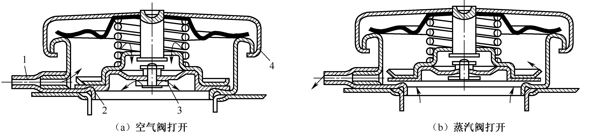
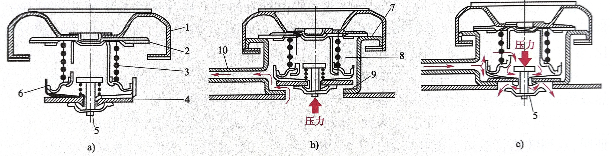

# 润换系统

---

## 功用

在发动机工作时连续不断地把数量足够、温度适当的洁净机油输送到全部传动件的摩擦表面，并在摩擦表面之间形成油膜，实现液体摩擦，从而减小摩擦阻力、降低功率消耗、减轻机件磨损，以达到提高发动机工作可靠性和耐久性的目的。

## 组成

1. 机油泵
2. 机油滤清器
3. 机油冷却器
4. 集滤器
5. 机油压力表
6. 温度表和机油管道

## 润滑方式

### 润滑方式的分类

1. 压力润滑
2. 飞溅润滑
3. 润滑脂润滑

### 不同部位采用的润滑方式

| 润滑方式  | 部位                     |
|:-----:|:---------------------- |
| 压力润滑  | 主轴承、连杆轴承、凸轮轴           |
| 飞溅润滑  | 气缸壁面、配气机构的凸轮、挺柱、气门杆和摇臂 |
| 润滑脂润滑 | 水泵、发电机轴承               |

## 机油牌号

1. 冬季用油：   
   1. SAE0W
   2. SAE5W
   3. SAE10W
   4. SAE15W
   5. SAE20W
   6. SAE25W
2. 非冬季用油
   1. SAE20
   2. SAE30
   3. SAE40
   4. SAE50

# 发动机冷却系统

---

## 功用

使发动机在所有工况下都保持在适当的温度范围内。冷却系统既要防止发动机过热，也要避免冬季发动机过冷。在发动机冷启动后，冷却系统还要保证发动机迅速升温，尽快达到正常的工作温度。

## 组成

1. 水泵
2. 散热器
3. 冷却风扇
4. 节温器
5. 补偿水桶
6. 发动机机体和汽缸盖中的水套

## 节温器

### 结构

1. 支架
2. 主阀门
3. 副阀门
4. 推杆
5. 节温器壳体
6. 石蜡
7. 胶管
8. 弹簧

### 功用

节温器是控制冷却液流动路径的阀门。

### 工作原理

当冷却液温度低于规定值时，节温器感温体内的石蜡呈固态，节温器阀在弹簧的作用下关闭发动机与散热器间的通道，冷却液经水泵返回发动机，进行小循环。当冷却液温度达到设定值后，石蜡开始熔化逐渐变成液体，体积随之增大并压迫橡胶管使其收缩，在橡胶管收缩的同时对推杆作用以向上的推力。由于推杆上端固定，因此，推杆对胶管和感温体产生向下的反推力使阀门开启。这时冷却液经由散热器和节温器阀，再径水泵流回发动机，进行大循环。

> 温度较低时，石蜡固态，主阀门关闭，进行小循环；

> 温度升高时，石蜡逐渐融化液态，推杆对胶管、节温器壳体产生向下反推力。

> 当温度升高到某一值时，主阀门开始开启，副阀门开始关闭；当温度达到一定值时，主阀门全开，副阀门全闭（关闭小循环水路）,进行大循环；当温度在主阀门开始开启温度与完全开启温度之间时，主副阀门均部分开启，大小循环同时进行。

## 散热器盖

### 功用

密封水冷系统并调节系统的工作压力。

### 结构

1. 通气管
2. 蒸汽阀
3. 空气阀
4. 散热器盖

1. 散热器盖
2. 上密封衬垫
3. 压力阀弹簧
4. 下密封衬垫
5. 真空阀
6. 压力阀
7. 冷却液加注口上密封面
8. 冷却液加注口
9. 冷却液加注口下密封面
10. 溢流管

### 工作原理

当发动机工作时，冷却液的温度逐渐升高。由于冷却液容积膨胀使冷却系统内的压力增高。当压力超过预定值时，压力阀开启，一部分冷却液经溢流管流入补偿水桶，以防止冷却液涨裂散热器。当发动机停机后，冷却液的温度下降，冷却系统内的压力也随之降低。当压力降到大气压力以下出现真空时，真空阀开启，补偿水桶内的冷却液部分地流回散热器，可以避免散热器被大气压压坏。

### 大小循环

#### 小循环

节温器关闭的情况，冷却液不流经散热器。

#### 大循环

节温器开启的情况，冷却经过散热器再回到发动机冷却水道。

### 气缸套分类

1. **无气缸套**

即不镶嵌任何气缸套的机体

- 优点
  1. 缩短汽缸中心距，从而减小机体尺寸、降低机体重量
  2. 机体刚度大，工艺性好
- 缺点
  1. 加工制造成本高

2- **干式气缸套**

在一般灰铸铁机体的气缸套座孔内压入或装入干式气缸套，干式气缸套不与冷却液接触。

3- **湿式气缸套**

气缸套外壁与冷却液直接接触。

# 配气机构

---

## 功用

根据发动机的工作顺序和各缸工作循环的要求，定时开启和关闭进、排气门，使新鲜可燃混合气（汽油机）或空气（柴油机）及时进入汽缸，并使汽缸内的燃烧废气及时排出。

> 按照发动机的工作顺序和工作循环要求，定时开启和关闭各缸的进排气门，使新气进入气缸，废气从气缸排出。

## 组成

*气门组*和*气门传动组*

1. 凸轮轴
2. 气门挺杆
3. 推杆
4. 摇臂
5. 摇臂轴
6. 气门弹簧座
7. 气门弹簧
8. 气门导管
9. 气门座
10. 气门
11. 曲轴

#### 凸轮轴下置式配气机构

#### 凸轮轴中置式配气机构

#### 凸轮轴上置式配气机构

